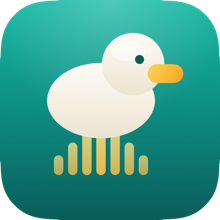
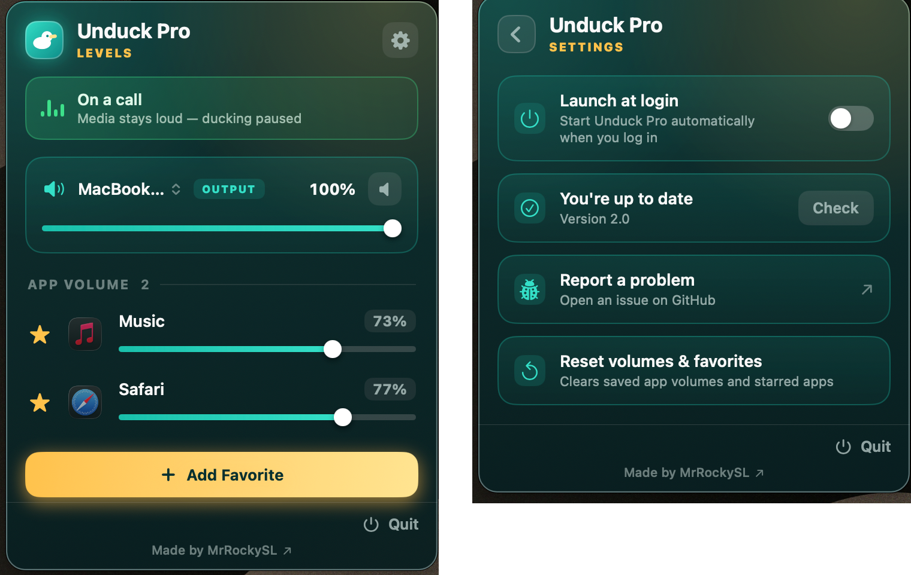

<div align="center">



# Unduck Pro

### Keep your media loud during calls — and mix every app's volume. For free.


[](../../releases/latest)

</div>

---

## The problem

You're deep in a song, a podcast, or a YouTube video — then a call comes in on
**FaceTime, Zoom, Google Meet, or Teams**. The second you join, macOS quietly
yanks everything else down to a whisper. It's called *audio ducking*, and Apple
gives you **no switch to turn it off**.

If you want your music to stay loud during a call, your only options are the
paid pro-audio apps — the kind that cost real money for what should be a single
toggle. Most people just put up with the quiet.

## The solution

**Unduck Pro** is a tiny menu-bar app that keeps your media at **full volume**
during calls — and the person on the other end still hears *only you*, never
your music. While it's at it, it also gives you a proper **per-app volume mixer**
and a quick **output-device switcher**, right from the menu bar.

No subscriptions. No paywall. No account. Just download it and it works.

---

## Features

- 🔊 **Media stays loud on calls** — FaceTime, Zoom, Meet, Teams and more. No ducking, no fiddling.
- 🙊 **No bleed** — your audio is never pushed into your mic, so callers hear only you.
- 📞 **Independent call volume** — turn FaceTime and other calls down without lowering your music or video.
- 🎛️ **Per-app volume mixer** — set each app's level independently (set it before it even plays, and it's remembered).
- 🎧 **Output switcher** — jump between speakers, AirPods, and other devices without opening System Settings.
- ⭐ **Favorites** — pin the apps you always want at hand.
- ⚡ **Automatic** — it notices when a call starts and stops on its own. Just keep it in your menu bar.
- 🚀 **Launch at login** — start it automatically when you log in (optional, in Settings).
- 🔔 **Update notifications** — it tells you when a new version is out, one click to download.
- 🪶 **Featherweight** — a small menu-bar app. No kernel extensions, no virtual audio cables.
- 💻 **Universal** — runs natively on both Intel and Apple Silicon Macs.
- 🆓 **Free & open source** (MIT).

> Requires **macOS 14.2 or newer** — it's built on Apple's modern Core Audio process-tap API.

---

## Everything in one little panel

<p align="center">
  
</p>

---

## Install

1. Download the latest **Unduck Pro `.dmg`** from the [Releases](../../releases/latest) page.
2. Open the DMG and drag **Unduck Pro** into your **Applications** folder.
3. **Allow it through macOS security.** Because the app is free and self-signed
   (not a paid, Apple-notarized certificate), macOS blocks the first launch with a
   *"can't be opened… Apple could not verify it is free of malware"* warning. To
   let it run:
   - Double-click the app once, then close the warning.
   - Open **System Settings → Privacy & Security**, scroll down to the message
     about **Unduck Pro**, and click **Open Anyway**, then **Open** to confirm.
   - *(On older macOS you can instead right-click the app → **Open** → **Open**.)*
4. When it asks for **microphone access**, click **Allow**. It needs audio access
   to do its job — it does **not** record or send your microphone anywhere. (You
   can also toggle this later under **Privacy & Security → Microphone**.)
5. Done — the duck appears in your menu bar and works automatically on your next call.

> It runs quietly while it's in your menu bar — there's nothing to switch on.
> Open the panel and use the **⚙︎ gear** for Settings (launch at login, updates), or **Quit** to stop it.

---

## Build from source

```bash
git clone https://github.com/MrRockySL/Unduck-Pro.git
cd Unduck-Pro
./script/make_cert.sh     # one-time: creates a local code-signing certificate
./script/build_app.sh     # builds and signs "Unduck Pro.app"
open "Unduck Pro.app"
```

The certificate step matters: macOS won't grant microphone access to an ad-hoc
signed app, so the build signs with a stable, self-signed certificate created by
`make_cert.sh`.

---

## How it works

Unduck Pro is built entirely on Apple's **public Core Audio process-tap** API
(macOS 14.2+) — no virtual drivers, no kernel extensions, no third-party code.

- **Un-duck:** it continuously resets macOS's ducking so your media snaps back to
  full volume — with no digital boost or distortion.
- **No bleed:** your media is routed through a private aggregate audio device that
  the call app never "hears," so it can't leak into the call.
- **Per-app mixer:** every playing app and call is routed through its own independent
  audio pipeline, scaled by your chosen volume, and passed through a hard limiter so
  nothing can ever blast your speakers.

---

## Contributing

This is an open project and contributions are very welcome. Found a bug, have a
feature idea, or want to improve something? **[Open an issue](../../issues)** or
send a **pull request** — let's make it better together.

---

## License

[MIT](LICENSE) — free to use, change, and share.

Made by **[MrRockySL](https://github.com/MrRockySL)**.
